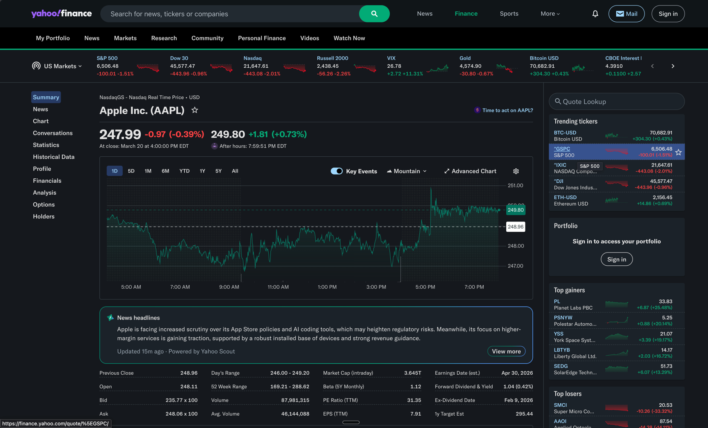
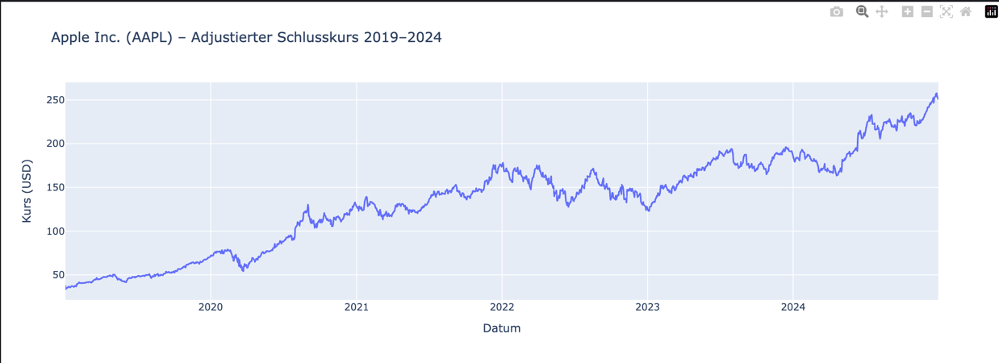
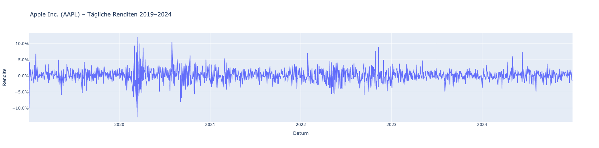
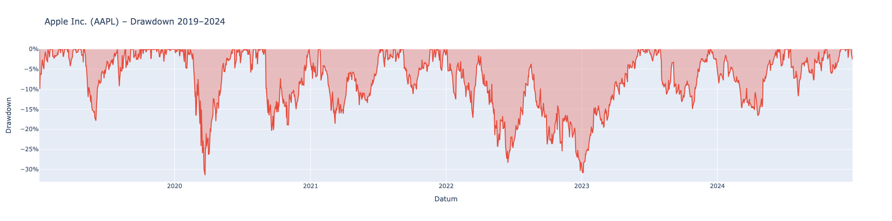

# Detailliertes Reporting für eine Aktie

Hintergrund: Damit fundierte unternehmerische Entscheidungen getroffen werden können, müssen die
Finanzdaten von Unternehmen untersucht werden. Verschiedene Analysen geben dabei sowohl Aufschluss über
Trends und Entwicklungen am Markt als auch eine Übersicht über Risiken und erwartbaren Renditen. Solche
Informationen können zum Beispiel als Grundlage für Controllinginstrumente, Optimierungsprozesse,
Investmentstrategien oder eine mögliche Kreditvergabe dienen.

Aufgabe ist es, die Finanzdaten eines börsennotierten Unternehmens detailliert zu
analysieren, dabei sind die folgenden Anforderungen zu erfüllen:
- Die Analysen sollen mit Python in einem Jupyter-Notebook durchgeführt werden. In dem Notebook
sollen der ausgeführte Quellcode und entsprechende Beschreibungen der Schritte enthalten sein.
- Wähle Dir für die Analysen selbst ein Unternehmen und beschaffe selbstständig die benötigten Daten aus
einer geeigneten Quelle.
- Nutze die akquirierten Daten, um statistische Analysen durchzuführen, Kennzahlen zu Rendite und Risiko
zu berechnen und nehme geeignete Datenvisualisierungen vor.
Hinweis: Bei dieser Aufgabe steht im Vordergrund, dass eine umfangreiche Menge von verschiedenen und
hochwertigen Analysen, Kennzahlberechnungen und Visualisierungen vorgenommen wird.

# Importieren der Daten
Um Aktiendaten zu importieren, verwenden wir die Python-Bibliothek [yfinance](https://pypi.org/project/yfinance/), die eine komfortable Möglichkeit bietet, verschiedene Finanzdaten aus diversen Online-Quellen wie Yahoo Finance abzurufen und in einem Pandas DataFrame zu speichern. Anschließend wählen wir die Aktien (bzw. Ticker) aus, die wir analysieren möchten.

# Unternehmen: Apple Inc. (AAPL)

Für diese Analyse wurde Apple Inc. (Ticker: AAPL) gewählt. Apple zählt zu den größten börsennotierten Unternehmen weltweit und hat globale Krisen wie die COVID-19-Pandemie erfolgreich überstanden. Der Analysezeitraum umfasst die Jahre 2019–2024 und eignet sich damit gut, um sowohl Krisenreaktionen als auch langfristige Wachstumstrends zu untersuchen.

Der folgende Chart zeigt den adjustierten Schlusskurs von AAPL über den gesamten Betrachtungszeitraum:

## Tägliche Renditen

Der folgende Chart zeigt die täglichen prozentualen Renditen von AAPL im Zeitraum 2019–2024. Die Renditen schwanken überwiegend in einem Bereich von ±3 %, was auf eine relativ stabile Kursentwicklung hindeutet. Besonders auffällig sind die starken Ausschläge Anfang 2020, die durch den COVID-19-bedingten Marktschock verursacht wurden und Extremwerte von über ±10 % erreichten. Ab 2021 normalisierte sich die Volatilität wieder deutlich, blieb aber mit vereinzelten Spitzen bis ±6 % weiterhin spürbar.

## Maximum Drawdown

Der folgende Chart zeigt den Drawdown von AAPL im Zeitraum 2019–2024, also den prozentualen Rückgang vom jeweils erreichten Höchststand. Der stärkste Einbruch ereignete sich Anfang 2020 im Zuge der COVID-19-Pandemie mit einem Drawdown von knapp −30 %. Nach einer raschen Erholung folgten weitere ausgeprägte Rückgänge: Ende 2020/Anfang 2021 sowie 2022 mit Werten um −25 % bis −27 %. Den tiefsten Punkt im gesamten Betrachtungszeitraum erreichte die Aktie Anfang 2023 mit rund −30 %. Ab Mitte 2023 erholte sich der Kurs merklich, mit deutlich flacheren Drawdown-Phasen in 2024.

